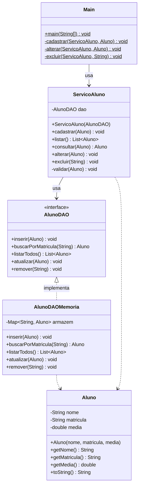

# SIGA — CRUD de Alunos

**Técnicas de Programação II · Aula 8** — CST em Desenvolvimento de Software Multiplataforma · Fatec de Porto Ferreira

Implementação de um CRUD de alunos usando o padrão **DAO** e uma camada de **serviço**, com tratamento de exceções e encapsulamento correto da coleção interna.

## Estrutura do projeto

```
siga-crud/
└── src/
    └── siga/
        ├── model/
        │   └── Aluno.java              (entidade de domínio)
        ├── dao/
        │   ├── AlunoDAO.java           (interface do DAO)
        │   └── AlunoDAOMemoria.java    (implementação em memória com Map)
        ├── service/
        │   └── ServicoAluno.java       (regras de negócio e validação)
        └── Main.java                   (camada de apresentação)
```

## Como compilar e executar

Pré-requisito: JDK 17 ou superior (`java -version` para verificar).

```bash
# 1. Criar a pasta de saída (apenas na primeira vez)
mkdir -p bin

# 2. Compilar
javac -d bin src/siga/model/*.java src/siga/dao/*.java src/siga/service/*.java src/siga/*.java

# 3. Executar
java -cp bin siga.Main
```

## Diagrama de classes



## Decisões de design

| Decisão | Justificativa |
|---|---|
| `Map<String, Aluno>` no DAO | Busca por matrícula em O(1) em vez de percorrer uma lista |
| Cópia defensiva em `listarTodos` | Impede que a camada de apresentação altere a coleção interna sem passar pelo serviço |
| Validação centralizada em `validar()` | Regra da média existe em um único lugar; alterá-la não cria divergências |
| Exceções semânticas (`IllegalArgumentException`, `IllegalStateException`, `NoSuchElementException`) | Cada exceção comunica o motivo do erro sem exigir mensagens genéricas |
| Injeção de dependência no `ServicoAluno` | Permite trocar a implementação do DAO (memória, banco, arquivo) sem alterar o serviço |